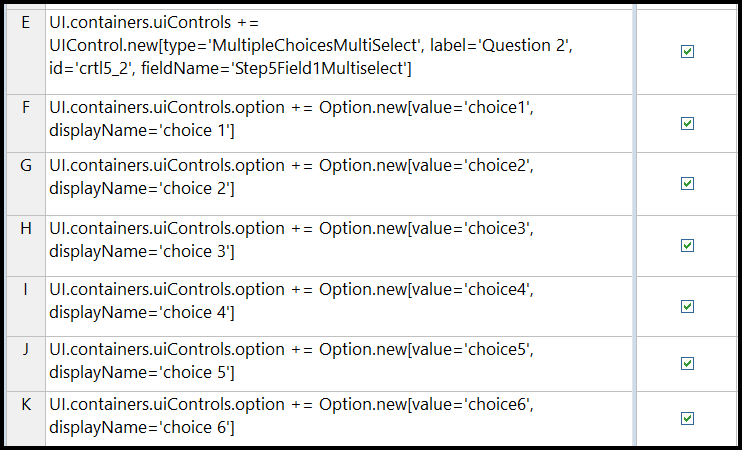
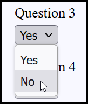

# Defining the Dynamic Form Business Rules in Corticon.js Studio

This document is intended for rule authors using Corticon.js Studio to define the logic and behavior of dynamic forms.

In Corticon Studio, rules are authored from a "Rule Vocabulary," which translates to a JSON definition when the rules are compiled into a JavaScript Decision Service. The vocabulary for dynamic forms involves two main parts:

1. **UI Definition Component:** Elements defining *how* the form renders, *when* specific controls appear, and *what* data structure will store the user's input.
2. **Form Purpose Component:** Elements specific to the *underlying purpose* of the form (e.g., a loan applicant's details, insurance claim information). These are defined separately based on the specific form's needs.

This document details the six vocabulary entities currently defined for the UI definition component: `UI`, `BackgroundData`, `Container`, `DataSourceOptions`, `Option`, and `UIControl`. `UI` is always the root element.

---

## Dynamic Form Vocabulary Elements and Usage

### UI

The root element for defining the overall state and flow of the dynamic form.

**Attributes:**

- **`pathToData`**
  - Data Type: *String* (Should map to a root-level entity name in your form's purpose vocabulary)
  - Description: Defines the primary data object where information entered by the user will be stored. This attribute acts as the crucial bridge between the UI definition component and the form's specific data model. By setting `pathToData` (typically in the first stage), you specify which vocabulary entity (e.g., `LoanApplication`, `InsuranceClaim`) will accrue the data collected via `UIControl` elements that have a corresponding `fieldName`. This collected data can then be used in later form stages or passed to subsequent processes.
  - Example: Setting `UI.pathToData = 'household'` in the rules results in accrued data structured like:
    ```json
    // Decision Service Input/Output Snippet
    [
      {"currentStageNumber": 0, "pathToData": "household"},
      // ... other UI data ...
      {
        "household": {
          "countyfips": "29095",
          "desiredQualityLevel": "3",
          "desiredMetalLevel": "Bronze"
        }
      }
    ]
    ```
    *(Note: The `household` entity and its attributes like `countyfips` must be defined in your specific form's purpose vocabulary.)*

- **`noUItoRender`**
  - Data Type: *Boolean*
  - Description: Set to `true` for stages where no UI needs to be rendered, but background processing (like calculations or data augmentation via other rulesheets) should occur. Defaults to `false` if not specified.
  - 

- **`done`**
  - Data Type: *Boolean*
  - Description: Set to `true` by the rules to signal the end of the dynamic form flow. The Client Side Component (CSC) – the JavaScript code rendering the form – typically uses this flag to trigger final data submission or transition to the next part of the application.
  - 

- **`nextStageNumber`**
  - Data Type: *Integer*
  - Where to specify: **Action** row of a rulesheet.
  - Description: Set by the rules to indicate which stage the form should proceed to next. If this is the final stage, leave this null and set `UI.done = true`.
  - 

- **`currentStageNumber`**
  - Data Type: *Integer*
  - Where to specify: Used in the **Filter** panel (Advanced View) of a rulesheet to determine if a rule applies to the current stage.
  - Description: The CSC sends this value in the input payload to the Decision Service, indicating which stage's rules should be evaluated. It typically gets this value from the `UI.nextStageNumber` returned in the previous step.
  - 

- **`language`**
  - Data Type: *String*
  - Description: Defines the language context. The CSC can pass an initial language, but rules can override this (e.g., `UI.language = 'italian'`) to change language dynamically during the form flow. Used primarily for rendering localized text in controls like `YesNo`.

---

### Container

Represents a logical grouping or panel within a form stage, containing UI controls.

Referenced in the rules as: `UI.containers`

**Description:** For all steps presenting UI to the user, the Decision Service specifies a list of containers via the `UI.containers` collection. Each container can have attributes like a title and holds one or more `UIControl` elements.


**Attributes:**

- **`id`**
  - Data Type: *String* (Must be unique within the current stage)
  - Description: Required unique identifier for the container.

- **`title`**
  - Data Type: *String*
  - Description: Text rendered as the header (e.g., `<h3>`) for the container.
  - 

- **`validationMsg`**
  - Data Type: *String*
  - Description: Optional text displayed as a validation message associated with the entire container.

- **`description`**
  - Data Type: *String*
  - Description: An optional descriptive string, not rendered by default but useful for rule troubleshooting or documentation.

---

### UIControl

Represents an individual form element (input field, text display, button, etc.).

Referenced in the rules as: `UI.containers.uiControls`

**Description:** Each container holds a collection of `UIControl` elements. The `type` attribute is crucial, determining which kind of control is rendered and what other attributes are relevant.

**Supported `type` values and Syntax:**

#### ReadOnlyText

- *Description:* Renders non-editable HTML text.
- *Rendered:* 

<details>
<summary>Rule Syntax</summary>

```javascript
// Example: Display static text
UI.containers.uiControls = UIControl.new [
  type='ReadOnlyText', 
  id='crtl0_1', 
  value = 'This is sample read-only text.'
]
````

 

</details>

##### TextArea

*Description:* Renders a multi-line text input field.

*Rendered:* 
<details>
<summary>Rule Syntax</summary>

```javascript
// Example: A comment box with size and length constraints
UI.containers.uiControls += UIControl.new [
  type='TextArea',
  id='crtl7_1', 
  fieldName='comments', // Links to vocabulary field 'comments'
  label = 'Enter your comments',
  labelPosition='Above', 
  cols=80, 
  rows=3, 
  min=5, // Min character length
  max=200 // Max character length
]
```
 

</details>

##### Text

*Description:* Renders a single-line text input field.

*Rendered:* 

 
<details>
<summary>Rule Syntax</summary>

```javascript
// Example: Street address with a default value
UI.containers.uiControls += UIControl.new [ 
  type = 'Text', 
  label = 'Street Address', 
  fieldName = 'streetAddress', // Links to vocabulary field 'streetAddress'
  id = 'addr_st', 
  value= '123 Main St' // Default value
]
```

 
</details>

##### Number

*Description:* Renders an input field specifically for numeric entry.
*Rendered:* ![Number Input Rendered]

<details>
<summary>Rule Syntax</summary>

```javascript
// Example: Age input
UI.containers.uiControls += UIControl.new [
  type='Number',
  fieldName='age', // Links to vocabulary field 'age'
  id='q_age', 
  label = 'Enter your age',
  min = 18, // Optional minimum value
  max = 120  // Optional maximum value
]
```


</details>

##### DateTime

*Description:* Renders a date or date-time picker input. Use `showTime=true` for date and time, otherwise it's date only.
*Rendered:* 
<details>
<summary>Rule Syntax</summary>

```javascript
// Example: Date of Birth (Date only)
UI.containers.uiControls += UIControl.new [
  type='DateTime', 
  id='dob_id', 
  label='Date of Birth', 
  fieldName='dob', // Links to vocabulary field 'dob'
  showTime = false, // Explicitly date only
  maxDT = '2007-04-10' // Example max date
]

// Example: Appointment Time (Date and Time)
UI.containers.uiControls += UIControl.new [
  type='DateTime', 
  id='appt_id', 
  label='Appointment Time', 
  fieldName='appointmentDateTime', // Links to vocabulary field 'appointmentDateTime'
  showTime = true, // Include time picker
  minDT = '2025-04-11' // Example min date
]
```


</details>

##### SingleChoice

*Description:* Renders a single choice input, typically as a checkbox.
*Rendered:*  

<details>
<summary>Rule Syntax</summary>

```javascript
// Example: Opt-in checkbox
UI.containers.uiControls += UIControl.new [
  type='SingleChoice', 
  label='Check the box to agree to terms',
  id='crtl4_1', 
  fieldName='agreedToTerms' // Links to boolean vocabulary field 'agreedToTerms'
]
```
 

</details>

##### MultipleChoices

*Description:* Renders a multi-choice input, typically as a dropdown list. The user can select only one option. Options can be defined directly in rules or fetched from a REST endpoint.

*Rendered:* 


 
 <details>
<summary>Rule Syntax (Options Defined by Rules)</summary>

```javascript
// Define the control
UI.containers.uiControls += UIControl.new [
  type = 'MultipleChoices',
  fieldName='sex', // Links to vocabulary field 'sex'
  id='q_sex',
  label = 'Please select the sex of the patient'
]

// Add options directly
UI.containers.uiControls.option += Option.new [displayName = 'Male', value = 'M']
UI.containers.uiControls.option += Option.new [displayName = 'Female', value = 'F']
```

</details>
<details>
<summary>Rule Syntax (Options Defined by REST Datasource)</summary>

**Rule Sheet 1: Define Control and DataSource URL**

```javascript
UI.containers.uiControls += UIControl.new [
  type='MultipleChoices',
  id='crtl2_1',
  fieldName='make', // Links to vocabulary field 'make'
  dataSource ='[https://api.npoint.io/d487567c8a34a506350e](https://api.npoint.io/d487567c8a34a506350e)', // URL providing options
  label='Please select the make of vehicle'
]
```

*(Ensure a ruleflow connector links this sheet to Rule Sheet 2 if DataSourceOptions are needed)*

**Rule Sheet 2: Define DataSource Options (Optional - only if endpoint keys are not 'value' and 'displayName')**

```javascript
UI.containers.uiControls.dataSourceOptions = DataSourceOptions.new [
  dataValueField = 'brand', // Key in JSON for the option's value
  dataTextField = 'brand'   // Key in JSON for the option's display text
]
```

</details>

##### MultipleChoicesMultiSelect

*Description:* Renders a multi-choice input where the user can select multiple options. Often rendered as a multi-select listbox or checkboxes.

*Rendered:* 


<details>
<summary>Rule Syntax</summary>

```javascript
// Define the control
UI.containers.uiControls += UIControl.new [
  type='MultipleChoicesMultiSelect', 
  label='Select applicable symptoms',
  id='crtl5_2', 
  fieldName='symptoms' // Links to collection vocabulary field 'symptoms'
]

// Add options
UI.containers.uiControls.option += Option.new [value='headache', displayName='Headache']
UI.containers.uiControls.option += Option.new [value='fever', displayName='Fever']
UI.containers.uiControls.option += Option.new [value='cough', displayName='Cough']
```



</details>

##### MultiText

*Description:* Allows the user to enter a variable number of single-line text strings. The renderer typically provides an "Add" button (+) to allow users to create more input fields dynamically.

<details>
<summary>Rule Syntax</summary>

```javascript
// Example: Entering multiple drug names
UI.containers.uiControls += UIControl.new [
  id='multiDrugs', 
  fieldName = 'drugToCover', // Links to collection vocabulary field 'drugToCover'
  type = 'MultiText',
  label = 'Enter medications to cover' 
]
```


</details>

##### YesNo

*Description:* Renders a binary choice, typically as a dropdown or radio buttons ('Yes'/'No'). Stores the literal string `'yes'` or `'no'` as the value.
*Rendered:* 

<details>
<summary>Rule Syntax</summary>

```javascript
// Example: Simple Yes/No question
UI.containers.uiControls += UIControl.new [
  type='YesNo',
  label='Do you smoke?', 
  id='crtl1_3', 
  fieldName='smokerResponse' // Links to vocabulary field 'smokerResponse'
]
```

 

</details>

##### YesNoBoolean

*Description:* Similar to `YesNo`, but stores a Boolean value (`true` for Yes, `false` for No) instead of strings.
*Rendered:* (Similar to YesNo)

<details>
<summary>Rule Syntax</summary>

```javascript
// Example: Boolean question
UI.containers.uiControls += UIControl.new [
  type = 'YesNoBoolean', 
  fieldName='onHTN_meds', // Links to boolean vocabulary field 'onHTN_meds'
  id='q_htn_meds', 
  label = 'Are you on medication for Hypertension?'
]
```
</details>

##### FileUpload

*Description:* Renders a button allowing the user to browse their local system and select a file for upload. The actual upload mechanism is handled by the CSC.
*Rendered:*  

<details>
<summary>Rule Syntax</summary>

```javascript
// Example: Uploading a document
UI.containers.uiControls += UIControl.new [
  type='FileUpload',
  label='Upload justification document:', 
  id='crtl6_1', 
  fieldName='justificationDoc' // Links to vocabulary field 'justificationDoc'
]
```
</details>

##### MultiExpenses

*Description:* A complex control designed for entering multiple expense items, each potentially having fields like category (dropdown), amount (number), and currency (dropdown). Allows users to add multiple expense entries dynamically.

*Rendered:* 

 

<details>
<summary>Rule Syntax</summary>

```javascript
// Define the control
UI.containers.uiControls += UIControl.new [
  type='MultiExpenses', 
  label='Enter all expenses:', 
  id='crtl8_1', 
  fieldName='expenses' // Links to collection vocabulary field 'expenses'
]

// Define options for the expense category dropdown within the control
UI.containers.uiControls.option += Option.new [value='hotelCode', displayName='Hotel']
UI.containers.uiControls.option += Option.new [value='carRentalCode', displayName='Car Rental']
UI.containers.uiControls.option += Option.new [value='airfareCode', displayName='Airfare']
```
 

</details>

**(End of UIControl Types)**

-----

**Common `UIControl` Attributes:**

  * **`type`**

      * Data Type: *String*
      * Description: (Covered above) The specific type of UI Control to render. Determines required/optional attributes.

  * **`fieldName`**

      * Data Type: *String*
      * Description: Crucial attribute that links the value entered/selected in this UI control to a specific attribute within the data entity defined by `UI.pathToData`. For example, if `UI.pathToData` is `'Person'` and a `UIControl` has `fieldName = 'dob'`, the selected date will be stored in the data model as `Person.dob`. Ensure the `fieldName` matches an attribute defined in your form's purpose vocabulary under the `pathToData` entity.

  * **`id`**

      * Data Type: *String* (Must be unique within the current container)
      * Description: Unique identifier for this specific UI control instance.

  * **`label`**

      * Data Type: *String*
      * Description: The text displayed as the label for the UI control.

  * **`value`**

      * Data Type: *String*, *Number*, *Boolean* (depends on control type)
      * Description: For input controls (`Text`, `Number`, `DateTime`, etc.), this provides a default value. For `ReadOnlyText`, this contains the actual text string to display.

  * **`labelPosition`**

      * Data Type: *String* (`'Above'`, `'Side'`)
      * Description: Optionally instructs the CSC where to place the `label` relative to the control. Default rendering depends on the CSC implementation.

  * **`dataSource`**

      * Data Type: *URL* (String pointing to a JSON REST endpoint)
      * Description: Used with `MultipleChoices` or `MultipleChoicesMultiSelect` to specify a URL from which to dynamically fetch the list of options. By default, the CSC expects the JSON endpoint to return an array of objects, each having `value` and `displayName` keys. Use `DataSourceOptions` to configure different key names or paths within the JSON response.
      *  
  
  * **`emphasize`**

      * Datatype: *Boolean*
      * Description: If set to `true`, instructs the CSC to render the `label` with emphasis (e.g., bold, different color). Actual rendering depends on CSC styling.

  * **`min` / `max`**

      * Data Type: *Number*
      * Description: Used with `Number` or `TextArea` controls to specify minimum/maximum numeric values or character lengths.

  * **`minDT` / `maxDT`**

      * Data Type: *Date* (String in 'YYYY-MM-DD' format or compatible with Date constructor)
      * Description: Used with `DateTime` controls to specify the minimum/maximum selectable date.

  * **`sortOptions`**

      * Data Type: *String* (`'A to Z'`, `'Z to A'`)
      * Description: Optionally instructs the CSC to sort the list of options (defined via `Option` or `dataSource`) for `MultipleChoices` or `MultipleChoicesMultiSelect` controls.

  * **`tooltip`**

      * Data Type: *String*
      * Description: Optional text to display as a tooltip when the user hovers over the UI control.

  * **(Other Attributes):** Attributes like `rows`, `cols` (for `TextArea`), `showTime` (for `DateTime`) are specific to certain control types.

-----

### DataSourceOptions

Provides configuration options when using `UIControl.dataSource` to fetch choices from a REST endpoint, especially if the endpoint's JSON structure doesn't match the default expectation (array of `{value: ..., displayName: ...}`).

Referenced in the rules as: `UI.containers.uiControls.dataSourceOptions`

**Attributes:**

  * **`dataTextField`**

      * Data Type: *String*
      * Description: Specifies the name of the key in the fetched JSON objects that should be used as the **display text** for each option in the dropdown/list. Use this if the key is not named `displayName`.
      *  
  
  * **`dataValueField`**

      * Data Type: *String*
      * Description: Specifies the name of the key in the fetched JSON objects that should be used as the **actual value** stored when an option is selected. Use this if the key is not named `value`.

  * **`pathToOptionsArray`**

      * Data Type: *String* (JSONPath syntax)
      * Description: Specifies the path within the fetched JSON response where the array of option objects is located, if it's not at the root level. Uses JSONPath syntax.
      * Example: `$.results[*]` to get all items within a `results` array.
      * Example: `$.[?(@.brand == '` + AutoQuote.vehicle\_make + `')]` to filter options based on other data.
      *  
-----

### Option

Used to define individual choices directly within the rules for `MultipleChoices`, `MultipleChoicesMultiSelect`, or `MultiExpenses` controls.

Referenced in the rules as: `UI.containers.uiControls.option`

**Attributes:**

  * **`displayName`**

      * Data Type: *String*
      * Description: The text displayed to the user for this option in the list/dropdown.

  * **`value`**

      * Data Type: *String*, *Number*, etc.
      * Description: The actual value that gets stored in the data model (at `pathToData.fieldName`) when the user selects this option.

-----

### BackgroundData

Used to retrieve data from an external REST JSON endpoint and directly populate the form's data model (`pathToData`) *without* presenting choices to the user. Useful for pre-filling data or enriching the model based on initial input.

Referenced in the rules as: `UI.backgroundData`

**Attributes:**

  * **`url`**

      * Data Type: *URL* (String)
      * Description: The URL of the JSON REST endpoint to fetch data from.

  * **`fieldNameN`** (e.g., `fieldName1`, `fieldName2`, ...)

      * Data Type: *String*
      * Description: The name of the attribute (within the `pathToData` entity or a specified `collectionName`) where the fetched data corresponding to `labelNameN` should be stored.

  * **`labelNameN`** (e.g., `labelName1`, `labelName2`, ...)

      * Data Type: *String*
      * Description: The name of the key in the fetched JSON whose value should be extracted and stored under `fieldNameN`.

  * **`pathToDataN`** (e.g., `pathToData1`, `pathToData2`, ...)

      * Data Type: *String* (JSONPath syntax)
      * Description: Optional JSONPath expression to locate the `labelNameN` within the fetched JSON structure, if it's not at the root level of the object being processed.

  * **`arrayToCollection`**

      * Data Type: *Boolean*
      * Description: If the endpoint returns an array of objects and this is `true`, the CSC will create a collection of child entities under the `pathToData` entity (or a sub-entity specified by `collectionName`). Each object in the fetched array becomes a separate entity instance in the collection.
      * Requires `collectionName` to be specified.
      * Requires `fieldNameN`/`labelNameN` pairs to map keys from the JSON objects to attributes in the new collection entities.
      * Example: Fetching `[{ "type": "A"}, {"type": "B"}]` with `pathToData='plan'`, `arrayToCollection=true`, `collectionName='benefits'`, `fieldName1='benefitType'`, `labelName1='type'` would result in data like: `plan.benefits = [ {benefitType: 'A'}, {benefitType: 'B'} ]`.

  * **`arrayToSet`**

      * Data Type: *Boolean*
      * Description: If the endpoint returns an array of objects and this is `true`, the CSC will extract values for a specific key (defined by `labelName1`) from *all* objects in the array and store them as a single, comma-separated string in the attribute specified by `fieldName1` under the `pathToData` entity.
      * Example: Fetching `[{ "type": "A"}, {"type": "B"}]` with `pathToData='plan'`, `arrayToSet=true`, `fieldName1='benefitList'`, `labelName1='type'` would result in data like: `plan.benefitList = 'A, B'`.

  * **`collectionName`**

      * Data Type: *String*
      * Description: Required when `arrayToCollection` is `true`. Specifies the name of the collection attribute (which must exist in your vocabulary under the `pathToData` entity) that will hold the newly created child entities.

<!-- end list -->

